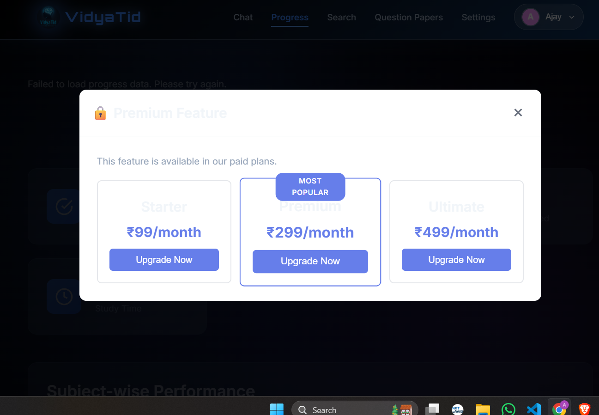

# Implementation Plan

- [x] 1. Database schema and models setup

- [x] 1.1 Create Usage model with daily tracking fields

  - Add usage_id, user_id, subscription_id, date, query_count, queries_limit, prediction_count, predictions_limit, feature_usage JSON fields
  - Create composite index on (user_id, date) for efficient lookups
  - Add relationships to User and Subscription models
  - _Requirements: 1.2, 11.1_

- [x] 1.2 Enhance Subscription model with new fields

  - Add scheduled_tier_change and scheduled_change_date fields for downgrades
  - Add tier validation to ensure only valid tiers (free, starter, premium, ultimate)
  - Update to_dict() method to include new fields
  - _Requirements: 5.5, 9.3_

- [x] 1.3 Enhance Payment model with metadata

  - Add payment_type field (subscription, upgrade, one_time)
  - Add metadata JSON field for additional payment information
  - Add subscription_id foreign key relationship
  - _Requirements: 10.1, 10.4_

- [x] 1.4 Create database migration script

  - Write migration to add Usage table
  - Write migration to alter Subscription table
  - Write migration to alter Payment table
  - Create indexes for performance
  - _Requirements: All database-related requirements_

- [ ]* 1.5 Write property test for database models
  - **Property 1: New user free tier initialization**
  - **Validates: Requirements 1.1**

- [x] 2. Tier configuration and constants

- [x] 2.1 Create tier configuration module

  - Define TIER_CONFIG dictionary with all tier details (prices, limits, features)
  - Define PREDICTION_FEATURES dictionary for prediction access
  - Create helper functions to get tier features and limits
  - Add validation for tier names
  - _Requirements: 1.1, 2.1, 3.1, 4.1, 13.1_

- [x] 2.2 Update config.py with Cloudflare settings

  - Add Cloudflare D1 database configuration
  - Add Cloudflare Workers AI configuration
  - Add Cloudflare R2 storage configuration
  - Add Cloudflare KV namespace configuration
  - Add production-specific settings
  - _Requirements: 15.1, 15.2, 15.3, 15.4_

- [x] 3. SubscriptionService implementation

- [x] 3.1 Implement core subscription management methods

  - Implement get_user_subscription(user_id) to fetch active subscription
  - Implement create_subscription(user_id, tier, duration_days, razorpay_sub_id)
  - Implement get_tier_features(tier) to return feature configuration
  - Add subscription status validation
  - _Requirements: 1.1, 2.2, 3.2, 4.2_

- [ ]* 3.2 Write property test for subscription creation
  - **Property 5: Subscription activation on payment**
  - **Validates: Requirements 2.2, 3.2, 4.2**

- [x] 3.3 Implement subscription lifecycle methods

  - Implement check_and_expire_subscriptions() to find and expire old subscriptions
  - Implement renew_subscription(user_id) for manual renewals
  - Implement cancel_subscription(user_id) with cancellation timestamp
  - Add scheduled downgrade execution logic
  - _Requirements: 5.1, 5.3, 5.4, 9.5_

- [ ]* 3.4 Write property test for subscription expiration
  - **Property 15: Subscription expiration**
  - **Validates: Requirements 5.1**

- [ ]* 3.5 Write property test for cancellation
  - **Property 17: Cancellation state consistency**
  - **Validates: Requirements 5.3**

- [x] 3.6 Implement upgrade and downgrade methods

  - Implement upgrade_subscription(user_id, new_tier) with immediate activation
  - Implement calculate_prorated_credit(current_tier, new_tier, days_remaining)
  - Implement downgrade_subscription(user_id, new_tier) with scheduling
  - Add validation to prevent invalid tier transitions
  - _Requirements: 5.5, 9.1, 9.2, 9.3, 9.4_

- [ ]* 3.7 Write property test for upgrades
  - **Property 19: Immediate upgrade activation**
  - **Validates: Requirements 5.5, 9.2**

- [ ]* 3.8 Write property test for proration
  - **Property 20: Prorated upgrade calculation**
  - **Validates: Requirements 9.1**

- [ ]* 3.9 Write property test for downgrades
  - **Property 21: Scheduled downgrade preservation**
  - **Validates: Requirements 9.3, 9.4**

- [x] 4. UsageTracker service implementation

- [x] 4.1 Implement usage tracking core methods

  - Implement get_usage(user_id, date) to fetch or create usage record
  - Implement increment_usage(user_id, query_type) with atomic counter increment
  - Implement check_limit(user_id) to verify if user can submit query
  - Implement get_remaining_queries(user_id) for UI display
  - _Requirements: 1.2, 1.3, 2.3, 3.3_

- [ ]* 4.2 Write property test for query counter
  - **Property 2: Query counter decrement consistency**
  - **Validates: Requirements 1.2, 2.3, 3.3**

- [ ]* 4.3 Write property test for limit enforcement
  - **Property 3: Query limit enforcement**
  - **Validates: Requirements 1.3**

- [x] 4.4 Implement daily reset functionality

  - Implement reset_daily_usage(date) to reset all users' counters
  - Query all users and reset based on their tier limits
  - Handle errors gracefully and log failed resets
  - Return count of successfully reset users
  - _Requirements: 1.4, 11.1, 11.2, 11.3_

- [ ]* 4.5 Write property test for daily reset
  - **Property 12: Daily reset completeness**
  - **Validates: Requirements 1.4, 11.1, 11.2**

- [ ]* 4.6 Write property test for post-reset queries
  - **Property 13: Post-reset query availability**
  - **Validates: Requirements 11.3, 11.5**

- [x] 4.7 Implement usage history and statistics

  - Implement get_usage_history(user_id, days) to fetch past usage
  - Implement get_usage_stats(user_id) for dashboard display
  - Add prediction counter tracking methods
  - Implement monthly prediction reset logic
  - _Requirements: 6.2, 13.3, 14.3, 14.4_

- [x] 4.8 Implement usage warning system

  - Add check for 80% usage threshold
  - Trigger warning notification when threshold reached
  - Track warning state to avoid duplicate notifications
  - _Requirements: 6.4_

- [ ]* 4.9 Write property test for usage warnings
  - **Property 14: Usage limit warning threshold**
  - **Validates: Requirements 6.4**

- [x] 5. FeatureGateService implementation

- [x] 5.1 Implement feature access control methods

  - Implement can_access_feature(user_id, feature) with tier checking
  - Implement get_available_features(user_id) to list accessible features
  - Implement check_query_limit(user_id) for query submission
  - Add feature-specific check methods (diagrams, image_solving, mock_tests, etc.)
  - _Requirements: 1.5, 8.1, 8.2, 8.3, 8.4, 8.5_

- [ ]* 5.2 Write property test for free tier restrictions
  - **Property 8: Free tier feature restrictions**
  - **Validates: Requirements 1.5, 8.1**

- [ ]* 5.3 Write property test for Starter tier access
  - **Property 9: Starter tier feature access**
  - **Validates: Requirements 2.4, 2.5, 8.2, 8.3**

- [ ]* 5.4 Write property test for Premium tier access
  - **Property 10: Premium tier feature access**
  - **Validates: Requirements 3.4, 3.5, 3.6, 8.4**

- [ ]* 5.5 Write property test for Ultimate tier access
  - **Property 11: Ultimate tier unrestricted access**
  - **Validates: Requirements 4.3, 4.4, 4.5, 8.5**

- [x] 5.6 Implement prediction feature gates

  - Implement check_prediction_access(user_id, prediction_type)
  - Implement check_prediction_limit(user_id) for monthly limits
  - Add prediction-specific feature checks
  - _Requirements: 13.1, 13.2, 13.3, 14.1, 14.3_

- [x] 5.7 Implement upgrade prompt generation

  - Implement get_upgrade_prompt(user_id, feature) to generate contextual prompts
  - Include which tiers provide the feature
  - Include pricing information
  - Return structured data for UI rendering
  - _Requirements: 1.5, 8.1, 8.2, 8.3, 13.1_

- [x] 6. Enhanced PaymentService implementation

- [x] 6.1 Implement tier-specific order creation

  - Implement create_order_for_tier(user_id, tier, duration) wrapper method
  - Map tier names to prices from TIER_CONFIG
  - Add metadata with tier and user information
  - Return order details for frontend
  - _Requirements: 2.1, 3.1, 4.1_

- [ ]* 6.2 Write property test for payment amounts
  - **Property 4: Payment amount correctness**
  - **Validates: Requirements 2.1, 3.1, 4.1**

- [x] 6.3 Implement webhook processing

  - Implement process_webhook(payload, signature) with signature verification
  - Parse webhook payload and extract payment details
  - Call SubscriptionService to activate subscription
  - Record payment in database
  - Handle different webhook event types
  - _Requirements: 7.1, 7.2, 7.3, 7.4_

- [ ]* 6.4 Write property test for webhook verification
  - **Property 23: Webhook signature verification**
  - **Validates: Requirements 7.1**

- [ ]* 6.5 Write property test for valid webhooks
  - **Property 24: Valid webhook processing**
  - **Validates: Requirements 7.2**

- [ ]* 6.6 Write property test for invalid webhooks
  - **Property 25: Invalid webhook rejection**
  - **Validates: Requirements 7.3**

- [x] 6.4 Implement upgrade payment processing

  - Implement process_upgrade_payment(user_id, new_tier) with proration
  - Calculate prorated amount using SubscriptionService
  - Create Razorpay order for difference
  - Handle payment capture and subscription update
  - _Requirements: 9.1, 9.2_

- [x] 6.5 Implement payment recording

  - Enhance record_payment() to include payment_type and metadata
  - Add subscription_id to payment records
  - Implement payment status update methods
  - Add refund recording functionality
  - _Requirements: 10.1, 10.2, 10.3, 10.4_

- [ ]* 6.6 Write property test for payment records
  - **Property 6: Payment record creation**
  - **Validates: Requirements 10.1**

- [ ]* 6.7 Write property test for payment status
  - **Property 7: Payment status transitions**
  - **Validates: Requirements 10.2, 10.3, 10.4**

- [ ]* 6.8 Write property test for payment failures
  - **Property 26: Payment failure handling**
  - **Validates: Requirements 7.4, 12.4**

- [x] 7. Enhanced EmailService implementation

- [x] 7.1 Implement subscription email templates

  - Create send_subscription_welcome(user_email, tier, end_date) method
  - Create send_subscription_renewal_reminder(user_email, tier, days_remaining) method
  - Create send_subscription_expired(user_email, tier) method
  - Create send_subscription_cancelled(user_email, tier, end_date) method
  - _Requirements: 12.1, 12.2, 12.3, 12.5_

- [x] 7.2 Implement payment notification emails

  - Create send_payment_failed(user_email, amount, reason) method
  - Create send_payment_success(user_email, amount, tier) method
  - Create send_upgrade_confirmation(user_email, old_tier, new_tier) method
  - _Requirements: 7.5, 12.4_

- [x] 7.3 Implement usage notification emails

  - Create send_usage_limit_warning(user_email, queries_remaining) method
  - Create send_prediction_limit_warning(user_email, predictions_remaining) method
  - _Requirements: 6.4_

- [ ]* 7.4 Write property test for email notifications
  - **Property 31: Subscription lifecycle emails**
  - **Validates: Requirements 7.5, 12.1, 12.3, 12.5**

- [x] 8. API routes implementation

- [x] 8.1 Create subscription routes blueprint

  - Create /api/subscription/current endpoint to get user's subscription
  - Create /api/subscription/upgrade endpoint for tier upgrades
  - Create /api/subscription/downgrade endpoint for tier downgrades
  - Create /api/subscription/cancel endpoint for cancellations
  - Add authentication middleware to all routes
  - _Requirements: 5.5, 9.1, 9.2, 9.3, 9.4, 9.5_

- [x] 8.2 Create payment routes enhancements

  - Enhance /api/payment/create-order to support tier-based orders
  - Create /api/payment/webhook endpoint for Razorpay webhooks
  - Create /api/payment/history endpoint for payment history
  - Add webhook signature verification
  - _Requirements: 2.1, 3.1, 4.1, 7.1, 7.2, 7.3, 10.5_

- [x] 8.3 Create usage routes

  - Create /api/usage/current endpoint for current day usage
  - Create /api/usage/history endpoint for usage history
  - Create /api/usage/stats endpoint for dashboard statistics
  - Add caching for frequently accessed data
  - _Requirements: 6.1, 6.2_

- [x] 8.4 Create feature gate middleware

  - Create check_feature_access decorator for route protection
  - Create check_query_limit decorator for query endpoints
  - Create check_prediction_limit decorator for prediction endpoints
  - Add upgrade prompt responses for blocked access
  - _Requirements: 1.5, 8.1, 8.2, 8.3, 13.1_

- [ ] 9. Prediction feature integration

- [x] 9.1 Enhance QuestionPredictor service

  - Add tier-based access checks to all prediction methods

  - Implement prediction counter tracking
  - Add monthly prediction limit enforcement
  - Integrate with FeatureGateService
  - _Requirements: 13.1, 13.2, 13.3, 14.1, 14.3_

- [x] 9.2 Update prediction routes with feature gates

  - Add feature gate checks to /api/prediction/predict-paper
  - Add feature gate checks to /api/prediction/smart-paper
  - Add feature gate checks to /api/prediction/complete-neet
  - Increment prediction counter on successful generation
  - Return upgrade prompts for restricted access
  - _Requirements: 13.1, 13.3, 14.1, 14.3_

- [x] 9.3 Implement prediction usage tracking

  - Add prediction_count field to Usage model tracking
  - Implement monthly prediction reset in UsageTracker
  - Add prediction history endpoint
  - Display prediction usage in dashboard
  - _Requirements: 13.3, 14.3, 14.4, 14.5_
-

- [x] 10. Scheduled tasks and background jobs

- [x] 10.1 Create daily reset scheduled task

  - Create cron job or Celery task for midnight UTC execution
  - Call UsageTracker.reset_daily_usage()
  - Log reset completion and any errors
  - Send alert if failure rate exceeds threshold
  - _Requirements: 1.4, 11.1, 11.2, 11.4_

- [x] 10.2 Create subscription expiration check task

  - Create hourly scheduled task
  - Call SubscriptionService.check_and_expire_subscriptions()
  - Send expiration notification emails
  - Execute scheduled downgrades
  - _Requirements: 5.1, 5.2, 5.4, 9.5_

- [x] 10.3 Create renewal reminder task

  - Create daily scheduled task
  - Query subscriptions expiring in 7 days
  - Send renewal reminder emails
  - Log reminder sending
  - _Requirements: 6.3, 12.2_

- [x] 10.4 Create monthly prediction reset task

  - Create monthly scheduled task (1st of each month)
  - Reset prediction counters for all users
  - Log reset completion
  - _Requirements: 14.4_

- [x] 11. Frontend UI components

- [x] 11.1 Create pricing page component

  - Design pricing cards for all four tiers
  - Highlight current user's plan
  - Add "Most Popular" badge to Premium tier
  - Implement responsive grid layout
  - Add hover animations and transitions
  - _Requirements: 16.1_

- [x] 11.2 Create usage dashboard component

  - Display daily query usage with progress bar
  - Display monthly prediction usage with progress bar
  - Show subscription status and end date
  - Add "Manage Subscription" button
  - Implement real-time usage updates
  - _Requirements: 6.1, 6.4, 16.2_

- [x] 11.3 Create feature gate modal component

  - Design modal for blocked feature access
  - Show which tiers include the feature
  - Display pricing for upgrade options
  - Add "Upgrade Now" and "Learn More" buttons
  - Make modal dismissible
  - _Requirements: 1.5, 8.1, 16.3_

- [x] 11.4 Create payment flow components

  - Design step indicator (Select Plan → Payment → Confirmation)
  - Integrate Razorpay embedded checkout
  - Add loading states during payment processing
  - Create success/failure animations
  - Display email confirmation message
  - _Requirements: 2.1, 3.1, 4.1, 16.4_

- [x] 11.5 Create subscription management page

  - Display current plan details and status
  - Show renewal date and auto-renew status
  - Add upgrade and cancel buttons
  - Display payment history table
  - Add download invoice functionality
  - _Requirements: 6.1, 6.5, 9.1, 9.3_

- [x] 11.6 Implement responsive design

  - Apply mobile-first CSS approach
  - Stack pricing cards vertically on mobile
  - Create collapsible navigation menu
  - Ensure touch-friendly button sizes (min 44x44px)
  - Test on multiple screen sizes
  - _Requirements: 16.5_

- [x] 11.7 Implement accessibility features

  - Ensure color contrast ratio ≥ 4.5:1
  - Add keyboard navigation support
  - Add ARIA labels to interactive elements
  - Add focus indicators
  - Test with screen readers
  - _Requirements: 16.5_

- [x] 12. Cloudflare deployment preparation

- [x] 12.1 Prepare database migration to Cloudflare D1

  - Export current SQLite database
  - Create D1 database schema
  - Write data migration script
  - Test migration in staging environment
  - _Requirements: 15.1_

- [x] 12.2 Configure Cloudflare Workers AI integration

  - Update cloudflare_ai.py service for production
  - Configure API tokens and account ID
  - Test LLM inference endpoints
  - Test embedding generation
  - Implement fallback to local models
  - _Requirements: 15.2_

- [x] 12.3 Setup Cloudflare R2 storage

  - Create R2 bucket for file storage
  - Upload NCERT content to R2
  - Upload diagrams to R2
  - Configure CDN URLs
  - Update file access paths in code
  - _Requirements: 15.3_

- [ ] 12.4 Configure Cloudflare KV for caching
  - Create KV namespace
  - Implement subscription data caching
  - Implement tier configuration caching
  - Set appropriate TTL values
  - Add cache invalidation logic
  - _Requirements: 15.4_

- [ ] 12.5 Deploy to Cloudflare Workers
  - Package Flask app for Workers runtime
  - Configure environment variables
  - Deploy backend API to Workers
  - Test all API endpoints
  - Monitor performance metrics

  - _Requirements: 15.1, 15.2, 15.3, 15.4_

- [ ] 12.6 Deploy frontend to Cloudflare Pages
  - Build static assets
  - Configure Pages project
  - Deploy to Cloudflare Pages
  - Configure custom domain
  - Enable analytics
  - _Requirements: 15.5_

- [-] 13. Testing and quality assurance

- [x] 13.1 Integration testing

  - Test complete subscription purchase flow
  - Test webhook processing with mock Razorpay
  - Test upgrade and downgrade flows
  - Test daily and monthly resets
  - Test feature gate enforcement
  - _Requirements: All_

- [-] 13.2 Load testing

  - Test concurrent payment processing
  - Test daily reset with large user base
  - Test API response times under load
  - Test database query performance
  - Optimize bottlenecks
  - _Requirements: All_

- [ ] 13.3 Security testing
  - Test webhook signature verification
  - Test SQL injection prevention
  - Test authentication bypass attempts
  - Test privilege escalation scenarios
  - Perform penetration testing
  - _Requirements: 7.1, 7.3_

- [ ] 14. Checkpoint - Ensure all tests pass
  - Ensure all tests pass, ask the user if questions arise.

- [-] 15. Documentation and deployment

- [x] 15.1 Create API documentation

  - Document all subscription endpoints
  - Document all payment endpoints
  - Document all usage endpoints
  - Include request/response examples
  - Add authentication requirements
  - _Requirements: All_

- [x] 15.2 Create deployment guide

  - Document Cloudflare setup steps
  - Document environment variable configuration
  - Document database migration process
  - Document rollback procedures
  - Create troubleshooting guide
  - _Requirements: 15.1, 15.2, 15.3, 15.4, 15.5_

- [x] 15.3 Create user documentation

  - Write subscription tier comparison guide
  - Write upgrade/downgrade instructions
  - Write payment troubleshooting guide
  - Create FAQ section
  - _Requirements: All_

- [ ] 16. Final checkpoint - Production readiness
  - Ensure all tests pass, ask the user if questions arise.
